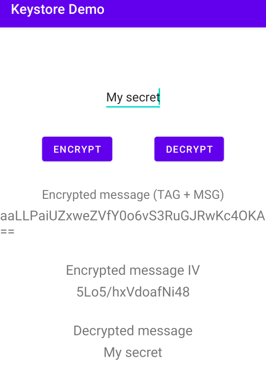

Damien Maier, Vincent Peer, Jean-François Pasche
# Introduction à *Android Keystore System*

Android met à disposition un outil spécifique dédié au stockage des données sensibles, le *Keystore System*.  A son apparition dans la version 1.6 d'Android, il n'était prévu que d'offrir une protection particulière aux clés de chiffrement utilisées dans les communications Wifi d'une part et dans les communications VPN d'autre part. Toutefois, depuis la version 4.0 du système d'exploitation pour mobiles (API level 14), ce module est ouvert à toutes les applications nécessitant de chiffrer des données. C'est utile non seulement pour les clefs cryptographiques, mais aussi pour les fichiers sensibles, peut importe son type.  
A partir de l'*API level 28*, le système proposé par Android peut s'appuyer sur les modules hardware dédiés à la gestions des clefs cryptographiques similaires au *Trusted Platform Module* (TPM) que l'on trouve désormais sur tous les PC récents.  
## But de la fonctionnalité
L'idée générale est **d'une part** de rendre l'extraction de l'appareil des clefs de chiffrement ou de signature cryptographique très difficile, même dans le cas où un attaquant aurait un accès physique complet à l'appareil de sa victime. Typiquement, un TPM permet de générer des clefs. Il dispose d'une API permettant de chiffrer et de déchiffrer des données avec du chiffrement asymétrique ou symétrique, ou d'effectuer des signatures cryptographiques.  
Mais rien n'est prévu pour extraire les clefs privées ou symétriques. Au contraire, tout est fait pour que cela soit rendu très difficile. Le *Keystore* est conçu pour offrir des caractéristiques similaires, tout en sachant que du harware dédié est indispensable si on a la nécessité d'un niveau maximal de protection.  
**D'autre part**, le *Keystore* gère les droits d'utilisation du matériel crryptographique selon le principe de la *white list*. Cela veut dire que seule les applications explicitement autorisées à l'utilisation d'une certaine clef y on accès. Typiquement, si une application `A` chiffre des données en passant par le *Keystore*, alors une application `B` ne pourra pas accéder aux clefs utilisées par l'application `A`, sauf en cas d'autorisation explicite. 

## Fonctionnement
Android propose 2 API pour la gestion des données chiffrées:
- L'API [`KeyChain`](https://developer.android.com/reference/android/security/KeyChain) est prévue pour des données partagées entre plusieurs applications.
- L'API [`KeyStore`](https://developer.android.com/reference/java/security/KeyStore) est prévue pour les données propre à l'application.

Dans ce qui suit, nous allons nous intéresser exclusivement à l'API `KeyStore`. Pour être plus exacte, Android ajoute une sur-couche à l'API Java standard `java.security.KeyStore` avec les classes de la librairie `android.security.keystore`.  
Le pincipe de base est que les clefs sont générées avec une alias, qui sert ensuite à les retrouver. C'est la seule chose que le développeur doit sauvegarder. Ci-dessous, nous montrons un exemple de classe qui permet de faire du chiffrement symétrique. Le code complet se trouve [ici](https://github.com/superjeffcplusplus/DAA_keystore/blob/main/app/src/main/java/ch/heigvd/daa/keystore/EncryptorSym.kt). Il est inspiré de [ce repo Github](https://github.com/philipplackner/AndroidCrypto). 
Pour bénéficier des fonctionnalités supplémentaires offertes par Android, il faut utiliser un KeyStore de type "AndroidKeyStore".

### Crypto Providers

La [page de la documentation Android](https://developer.android.com/reference/kotlin/javax/crypto/Cipher) dédiée à la classe `Cipher` peut induire en erreur quant aux algorithmes disponibles. En effet, elle ne mentionne pas que les algorithmes disponibles ne dépandent pas de la classe `Cipher` en soi mais du *Crypto Provider* passé en argument à la fonction `KeyGenerator.getInstance`. Cet extrait de code permet de lister ces *providers* ainsi que les algorithmes disponibles pour chacun d'eux :

```Kotlin
val providers = Security.getProviders()
for (p in providers) {
    Log.i("CRYPTO", "provider: " + p.name)
    for (s in p.services) {
        Log.i("CRYPTO", " algorithm: " + s.algorithm)
    }
}
````
"AndroidKeyStore" est à recommander si l'on veut se limiter à des algorithmes sûrs. Le *provider* "AndroidOpenSSL" peut être utile si la nécessité d'utilisé des algorithmes plus recommandés aujourd'hui, comme 3DES, se présente. "AndroidOpenSSL" propose aussi des algorithmes plus exotiques comme ChaCha20 (chiffrement symétrique). Cependant, on perd la possibilité d'utiliser les classes de `android.security.keystore`, qui permettent de gérer automatiquement l'enregistrement des clefs dans le `KeyStore` d'Android. Du moins cela devient beaucoup plus compliqué d'enregistrer les clefs.
Voici une liste exhaustive des algorithmes disponibles avec "AndroidKeyStore":
```
EC, RSA, XDH, EC, RSA, XDH, AES, HmacSHA1, HmacSHA224, HmacSHA256, HmacSHA384, HmacSHA512, ECDH, XDH, AES, HmacSHA1, HmacSHA224, HmacSHA256, HmacSHA384, HmacSHA512
```

### La classe `EncryptorSym`

L'import suivant est nécessaire pour utiliser l'AndroidKeyStore :
```
implementation "androidx.security:security-crypto:1.0.0"
```

Pour commencer, nous définissons un `companion object` pour définir les algorithmes choisis.

```Kotlin
companion object {
    private const val ALGORITHM = KeyProperties.KEY_ALGORITHM_AES
    private const val BLOCK_MODE = KeyProperties.BLOCK_MODE_GCM
    private const val PADDING = KeyProperties.ENCRYPTION_PADDING_NONE
    private const val TRANSFORMATION = "$ALGORITHM/$BLOCK_MODE/$PADDING"
}
```
Ici, `BLOCK_MODE_GCM` est un nom trompeur. En effet, GCM n'est pas à proprement parler un mode de chiffrement, mais un algorithme de chiffrement authentifié utilisant en fait le mode CTR pour le chiffrement des donnée. CTR étant un mode de chiffrement par flux, il ne nécessite pas de padding, d'où la valeur `ENCRYPTION_PADDING_NONE` pour le padding.
`TRANSFORMATION` est la chaîne de cractère qui représente les choix effectué. Ici, elle vaut `AES/GCM/NoPadding`. De manière générale, elle suit la forme [`algorithm/mode/padding`](https://developer.android.com/reference/javax/crypto/Cipher). Beaucoup de combinaisons sont possibles. Nous ferons quelques recommendations d'algorithmes par la suite.

### Création du KeyStore

```Kotlin
private val keyStore = KeyStore.getInstance("AndroidKeyStore").apply {
        load(null)
}
```

### Génration de clef

```Kotlin
pivate fun generateKey(): SecretKey {
        val keyGenerator = KeyGenerator.getInstance(ALGORITHM, "AndroidKeyStore")
        val keyGenParameterSpec = KeyGenParameterSpec.Builder(
            keyAlias,
            KeyProperties.PURPOSE_ENCRYPT or KeyProperties.PURPOSE_DECRYPT
        )
            .setBlockModes(BLOCK_MODE)
            .setEncryptionPaddings(PADDING)
            .build()
        keyGenerator.init(keyGenParameterSpec)
        return keyGenerator.generateKey()
    }
```

A bien noter ici que nous choisissons "AndroidKeyStore" comme *provider*. Android a choisi le même nom que pour le type de `KeyStore`, mais attention ce n'est pas la même chose ! Cependant, utiliser un autre *provider* risque d'empêcher l'utilisation de l'Android KeyStore ([voir exemple ChaCha20](https://github.com/superjeffcplusplus/DAA_keystore/blob/main/app/src/main/java/ch/heigvd/daa/keystore/EncryptorSymChaCha20.kt)).
`KeyGenParameterSpec` permet de définir l'usage que l'on va faire de la clef. Cela permet d'améliorer la gestion des clefs. C'est particulièrement utile dans le cadre de la cryptographie asymétrique en empêchant de signer avec une clef publique par exemple.  
`keyAlias` est une propriété de la classe. C'est en quelque sorte le nom que l'on veut donner à la clef.

### Chiffrement

````Kotlin
fun encrypt(toEncrypt: ByteArray): EncryptedFileBox {
        val cipher: Cipher = Cipher.getInstance(TRANSFORMATION)
        cipher.init(Cipher.ENCRYPT_MODE, secretKey)
        val iv = cipher.iv
        val encryption = cipher.doFinal(toEncrypt)
        return EncryptedFileBox(iv, encryption)
    }
````
`secretKey` est dans notre exemple une propriété de classe. La plupart des algorithmes de chiffrement symétrique utilisent des IV (initialization vector). Il est indispensable de le récupérer et de le sauvegarder, sans quoi le déchiffrement sera impossible. L'IV n'est pas confidentiel mais pour presque algorithmes, il ne faut surtout pas qu'il soit répété. Il est à noter que l'API d'Android empêche de faire cette erreur en ne laissant pas possibilité de choisir l'IV lors du chiffrement.  
`EncryptedFileBox` est une `data class` qui encapsule de chiffré et l'IV :
```Kotlin
data class EncryptedFileBox(val iv: ByteArray, val cipherText: ByteArray) {
    override fun equals(other: Any?): Boolean {
        // ...
    }

    override fun hashCode(): Int {
        //...
    }
}
```
### Déchiffrement
```Kotlin
fun decrypt(toDecrypt: EncryptedFileBox): ByteArray {
    val cipher = Cipher.getInstance(TRANSFORMATION)
    // Tag is 128 bits length (default)
    cipher.init(Cipher.DECRYPT_MODE, secretKey, GCMParameterSpec(128, toDecrypt.iv))
    return cipher.doFinal(toDecrypt.cipherText)
}
```
Pour déchiffrer, il faut simplement requérir une instance de `Cipher` avec la bonne transformation.
## Choix des algorithmes

Un très large choix d'algorithmes sont proposés par Android, dont beaucoup sont à éviter car plus sécurisé aujourd'hui. Leur présence est due à des questions de rétrocompatibilité. A noter que dans le cas de l'utilisation de harware dédié, que nous ne présentons pas en détail ici, le choix des algorithmes est beaucoup plus restreint, ce qui est une bonne chose pour éviter les erreur.  
La documentation Android propose [un petit guide sur la cryptographie](https://developer.android.com/guide/topics/security/cryptography). Les recommandations d'algorithmes nous paraissent bonnes : 


Par rapport au chiffrement symétrique, si la clef n'est pas réutilisée très souvent et que les données à chiffrer n'excèdent jamais 64GB, nous conseillons d'utiliser GCM. En fait, c'est le  cas pour la plupart des utilisations. ECB seul n'authentifie pas les données, donc si on veut garantir l'intégrité et l'authenticité des données en plus de la confidentialité, il faut l'utiliser en combinaison d'un MAC. Dans ce cas, nous conseillons de chiffrer puis d'authentifier les données (Encrypt-Then-Mac).  

## Utiliser AndroidOpenSSL
Android propose aussi ChaCha20 pour chiffrer les données, avec Poly1305 pour l'authentification des données. C'est un bon algorithme et il est au goût du jour. Il a comme désavantage de ne pas bénéficier d'instructions CPU spécifiques, contrairement à AES. Dans un environnment ne disposant pas d'accélération matérielle AES, ChaCha20 sera cependant plus rapide qu'AES. Nous fournissons [un exemple d'utilisation de ChaCha20](https://github.com/superjeffcplusplus/DAA_keystore/blob/main/app/src/main/java/ch/heigvd/daa/keystore/EncryptorSymChaCha20.kt) avec Poly1305 pour l'authentification. Il nécessite d'utiliser "AndroidOpenSSL" comme *Crypto Provider* et nous n'avons en fait pas réussi à utiliser *Android KeyStore* dans ce cas.

## Exemple complet

[Notre exemple complet](https://github.com/superjeffcplusplus/DAA_keystore) est une petite application qui chiffre et déchiffre une entrée utilisateur. Cela peut servir de base pour la prise en main du `KeyStore`. On y trouve plusieurs dépendances à intégrer dans le [build gradle module app](https://github.com/superjeffcplusplus/DAA_keystore/blob/0a891837c8db97c1c1a89545441e139ab97cdf74/app/build.gradle).
A partir des fonctionnalités introduites, une entrée textuelle est chiffrée puis affichée. On peut ensuite déchiffrer l'entrée afin de retrouver le texte original. 

<picture> 
    
</picture>

Dans `MainActivity`, nous instancions `EncryptorSym` avec l'alias de clef :
```
private val encryptor = EncryptorSym("secret")
```
Cet alias va permettre d'utiliser toujours la même clef à chaque nouvelle ouverture de l'app.
Cet exemple montre comment gérer de façon plus sécurisée des données dans une application de plus grande ampleur.  
A noter que pour un même message, le chiffré est change à chaque chiffrement en raison du changement d'IV.

## Problème résolu et limitations
Grâce à *Android Keystore*, le développeur d'application Android n'aura qu'à ajouter quelques lignes de codes pour chiffrer des données. Il aura à choisir un algorithme parmi un choix limité. En outre, l'API d'utilisation du Keystore est faite de telle manière à éviter les erreurs comme la réutilisation de vecteurs d'initialisation (IV). Utiliser les API d'*Android Keystore* rend donc la gestion des clefs beaucoup plus facile et permet d'éviter certaines erreurs de programmation qui pourraient complètetment compromettre la confidentialité, l'intégrité et l'authenticité des données. Par exemple, l'algorithme de signature digitale asymétrique DSA nécessite de tirer une valeur aléatoire pour chaque signature. Si la même valeur est réutilisée pour 2 signatures différentes, alors il devient possible de retrouver la clef privée.  
Par rapport aux limitations, il faut être conscient que l'*Android Keystore* est en fait une implémentation façon Android du KeyStore de la librarie `java.security`. Cette implémentation est utilisée lorsqu'on fait appel à  `KeyStore.getInstance("AndroidKeyStore")`. Les algorithmes sont limités. Comme nous l'avons vu, il est possible d'utiliser "AndroidOpenSSL" comme *Crypto provider* pour générer des clefs, chiffrer et déchiffrer. Cependant, nous n'avons pas trouvé le moyen de stocker ces clefs dans l'*Android Keystore*, car "AndroidOpenSSL" ne supporte pas la classe `KeyGenParameterSpec.Builder`, qui elle est ajoutée par `android.security.keystore.KeyGenParameterSpec`. En conclusion, comme souvent avec ces solutions "clefs en main", sortir des sentiers tracés implique beaucoup plus d'investissement en temps.

## Liens utiles

- [Documentation officielle sur le Keystore System](https://developer.android.com/training/articles/keystore#kotlin)
- [Documentation officielle sur le hardware dédié](https://source.android.com/docs/security/features/keystore)
- [Guide Android sur la cryptographie](https://developer.android.com/guide/topics/security/cryptography)
- [Un autre exemple d'utilisation du Keystore](https://github.com/philipplackner/AndroidCrypto)
